+++
date = '2025-07-22T05:44:53+02:00'
draft = false
title = 'Core Concepts'
weight = 2
+++

The Lens SDK is designed around a set of robust, interoperable components. A thorough understanding of these core concepts is essential for leveraging the full power and security of the SDK. This document provides a detailed overview of the foundational pillars of the Lens architecture: the `LensService`, the `Site` Program, the Federation Model, and the Access Control System.

## 1. The Layered Architecture

The SDK employs a strict, layered architecture to promote modularity, security, and maintainability. Each layer has a distinct responsibility, and communication flows vertically through well-defined interfaces.

```mermaid
graph TD
    A[📱 <b>Application Layer</b><br><i>UI, Backend, CLI</i>] -->|Consumes| B[🧩 <b>Service Layer</b><br><i>LensService: Public API</i>]
    B -->|Orchestrates| C[🔗 <b>Federation & Program Layer</b><br><i>FederationManager, Site Program</i>]
    C -->|Built Upon| D[🌐 <b>P2P Framework Layer:</b><br><i>Peerbit</i>]

    %% Styling
    classDef layer stroke-width:1px,rx:10,ry:10;
    class A,B,C,D layer;

```

* **Service Layer (`LensService`):** This is the canonical public interface for the SDK. It is the sole entry point for any consuming application. Its purpose is to provide a stable, high-level, and asynchronous API that completely abstracts the complexities of the underlying P2P network and program logic. The service layer is responsible for managing the lifecycle of the P2P client and the active `Site` program.

* **Program Layer (`Site` Program):** This is the "on-chain" or decentralized backend of the application. The `Site` program is a stateful, replicable "smart contract" that defines the application's data schemas, databases, and the immutable rules governing data access. It is the ultimate source of truth for all content and permissions within a given `Site`.

* **Federation Layer (`FederationManager`):** This is a specialized, internal component managed by the `LensService`. It orchestrates all inter-program communication. While the `Site` program defines *what* data exists, the `FederationManager` defines *how* that data is discovered, synchronized, and shared between different `Site` instances.

* **P2P Framework Layer (Peerbit):** The foundational layer that provides the necessary primitives for peer-to-peer networking, database creation, data replication, and cryptographic identity. The Lens SDK is built directly upon this robust framework.

## 2. The `Site` Program: A Sovereign Digital Entity

The central construct in the Lens ecosystem is the `Site`. Conceptually, a `Site` is a sovereign, addressable, and self-contained digital space. It functions as a decentralized application instance, complete with its own databases and access control system.

### Key Characteristics of a `Site`

* **Unique, Verifiable Address:** Every `Site` is identified by a permanent, cryptographic address derived from its owner's public key and its initial parameters. This address is used to locate, open, and interact with the `Site` on the network.
* **Structured Data Stores:** A `Site` is a collection of discrete, purpose-built data stores for `Releases`, `ContentCategories`, `Subscriptions`, and more. This structured approach ensures data integrity and organizational clarity.
* **Explicit Permissions:** Access to a `Site` is not public by default. All write permissions are explicitly granted by an **Administrator** through a robust Role-Based Access Control (RBAC) system.

## 3. The Federation Model: Principled Data Exchange

Federation is the process by which independent `Site` instances share data. The Lens SDK implements a principled, subscription-based model to ensure that all data exchange is intentional and secure.

### The Federation Lifecycle

1. **Explicit Subscription:** The process is initiated by a user with `subscription:manage` permission (typically a `Moderator` or `Admin`). To federate, they create a `Subscription` record containing the target `Site`'s address. This action is a deliberate declaration of trust.

2. **State Synchronization:** Upon the creation of a `Subscription`, the `FederationManager` performs two types of synchronization:
    * **Historical Sync:** A one-time process that connects to the remote `Site` and replicates its existing public content (e.g., `Releases`).
    * **Live Sync:** The manager subscribes to the remote `Site`'s dedicated pub/sub topic, creating a persistent, real-time communication channel for immediate updates.

3. **Data Provenance:** All data received via federation is immutable and retains the cryptographic signature of its original author and the address of its originating `Site`. This guarantees that the source of all content can be verified.

4. **Lifecycle Termination:** If a `Subscription` is deleted, the `FederationManager` performs a cleanup operation, purging all data associated with the unsubscribed `Site` from its local databases.

## 4. The Access Control System (RBAC)

Security is integral to the `Site` program. The system is built on a robust and secure **Role-Based Access Control (RBAC)** model, managed by a dedicated internal `RoleBasedccessController`. This controller is the ultimate authority for all actions within a `Site`.

### Identity and Signing

Every action that modifies a `Site` (like adding a release or assigning a role) must be cryptographically signed. The Lens SDK supports two models for this identity:

1. **Default Node Identity:** If you initialize `LensService` without specifying a custom identity, it will use an auto-generated identity tied to the Peerbit node itself. This is suitable for server-side scripts or headless nodes where a single, consistent identity is desired.

2. **Custom Wallet Identity:** For user-facing applications, the recommended approach is to provide a custom identity derived from the user's own wallet (e.g., MetaMask). When you instantiate `LensService` with this custom identity, **all subsequent actions are signed by the user's wallet**. This ensures that the user, not the application node, is the true owner and author of their content. This is the foundation of data sovereignty in the Lens SDK.

### The RBAC Components

* **Administrators (`TrustedNetwork`):** At the top level is a `TrustedNetwork` of administrators. Any user whose public key is in this network is considered an **Admin**. Admins have universal permissions and are the only users who can manage the RBAC system itself (e.g., create new roles, assign roles to users, or add other Admins). The initial creator of a `Site` is its first `Admin`.

* **Roles:** A `Role` is a named collection of specific permissions. A `Site` is initialized with a set of default roles, and Admins can create new custom roles as needed.

* **Permissions:** A `Permission` is a granular string that represents a specific action, typically in the format `"resource:action"` (e.g., `"release:delete"`).

* **Assignments:** An `Assignment` is a verifiable link between a user's public key and a `Role`. A user gains permissions by virtue of the roles they are assigned.

### Default Roles and Permissions Table

A `Site` comes with a clear set of default roles, providing a sensible permission structure out of the box. An **Admin** can perform all actions listed below.

| Action / Permission (`resource:action`) | Moderator | Member | Guest | Description                                                              |
|-----------------------------------------|:---------:|:------:|:-----:|--------------------------------------------------------------------------|
| **`release:create`**                    | ✅        | ✅     | ❌    | Can publish new `Release` documents.                                     |
| **`release:edit:own`**                  | ✅        | ✅     | ❌    | Can edit `Release` documents they personally posted.                     |
| **`release:edit:any`**                  | ✅        | ❌     | ❌    | Can edit `Release` documents posted by *any* user on the site.           |
| **`release:delete`**                    | ✅        | ❌     | ❌    | Can delete any `Release` from the site.                                  |
| **`featured:manage`**                   | ✅        | ❌     | ❌    | Can create, edit, or delete `FeaturedRelease` entries.                   |
| **`category:manage`**                   | ✅        | ❌     | ❌    | Can create, edit, or delete `ContentCategory` documents.                 |
| **`blocklist:manage`**                  | ✅        | ❌     | ❌    | Can create or delete `BlockedContent` entries.                           |
| **`subscription:manage`**               | ✅        | ❌     | ❌    | Can subscribe to or unsubscribe from other sites.                        |

* **Guest (Implicit Role):** This is the default status for any user who is not an Admin and has not been assigned any roles. `Guests` have read-only access and cannot perform any write operations.

### Federation and Permissions

The RBAC model extends intelligently to federated content. While trust is primarily based on the subscription, the Lens SDK provides a powerful override: **a local `Admin` or `Moderator` can always act on federated content** (e.g., delete a stale post from an unsubscribed site). This ensures that local site owners maintain ultimate control over the content stored in their databases.
