+++
date = '2025-07-22T05:44:53+02:00'
draft = false
title = 'Core Concepts'
weight = 2
+++

The Lens SDK is designed around a set of robust, interoperable components. A thorough understanding of these core concepts is essential for leveraging the full power and security of the SDK. This document provides a detailed overview of the foundational pillars of the Lens architecture: the `LensService`, the `Site` Program, the Federation Model, and the Access Control System.

## 1. The Layered Architecture

The SDK employs a strict, layered architecture to promote modularity, security, and maintainability. Each layer has a distinct responsibility, and communication flows vertically through well-defined interfaces.

```mermaid
graph TD
    A[📱 <b>Application Layer</b><br><i>UI, Backend, CLI</i>] -->|Consumes| B[🧩 <b>Service Layer</b><br><i>LensService: Public API</i>]
    B -->|Orchestrates| C[🔗 <b>Federation & Program Layer</b><br><i>FederationManager, Site Program</i>]
    C -->|Built Upon| D[🌐 <b>P2P Framework Layer:</b><br><i>Peerbit</i>]

    %% Styling
    classDef layer stroke-width:1px,rx:10,ry:10;
    class A,B,C,D layer;

```

* **Service Layer (`LensService`):** This is the canonical public interface for the SDK. It is the sole entry point for any consuming application. Its purpose is to provide a stable, high-level, and asynchronous API that completely abstracts the complexities of the underlying P2P network and program logic. The service layer is responsible for managing the lifecycle of the P2P client and the active `Site` program.

* **Program Layer (`Site` Program):** This is the "on-chain" or decentralized backend of the application. The `Site` program is a stateful, replicable "smart contract" that defines the application's data schemas, databases, and the immutable rules governing data access. It is the ultimate source of truth for all content and permissions within a given `Site`.

* **Federation Layer (`FederationManager`):** This is a specialized, internal component managed by the `LensService`. It orchestrates all inter-program communication. While the `Site` program defines *what* data exists, the `FederationManager` defines *how* that data is discovered, synchronized, and shared between different `Site` instances.

* **P2P Framework Layer (Peerbit):** The foundational layer that provides the necessary primitives for peer-to-peer networking, database creation, data replication, and cryptographic identity. The Lens SDK is built directly upon this robust framework.

## 2. The `Site` Program: A Sovereign Digital Entity

The central construct in the Lens ecosystem is the `Site`. Conceptually, a `Site` is a sovereign, addressable, and self-contained digital space. It functions as a decentralized application instance, complete with its own databases and access control lists.

### Key Characteristics of a `Site`:

* **Unique, Verifiable Address:** Every `Site` is identified by a permanent, cryptographic address derived from its owner's public key. This address is used to locate, open, and interact with the `Site` on the network.
* **Structured Data Stores:** A `Site` is not a monolithic database. It is a collection of discrete, purpose-built data stores, each governed by its own schema. This includes stores for `Releases`, `ContentCategories`, `Subscriptions`, and more. This structured approach ensures data integrity and organizational clarity.
* **Explicit Permissions:** Access to a `Site` is not public by default. All write permissions are explicitly granted by an `Administrator` through cryptographically verifiable Access Control Lists (ACLs). This "default-deny" posture is fundamental to the security model.

## 3. The Federation Model: Principled Data Exchange

Federation is the process by which independent `Site` instances share data with one another. The Lens SDK implements a principled, subscription-based federation model to ensure that all data exchange is intentional and secure.

### The Federation Lifecycle:

1. **Explicit Subscription:** The process is always initiated by a `Site` Administrator. To federate with another `Site`, an administrator must create a `Subscription` record containing the target `Site`'s address. This action is a deliberate declaration of trust.

2. **State Synchronization:** Upon the creation of a `Subscription`, the `FederationManager` performs two types of synchronization:
    * **Historical Sync:** A one-time process that connects to the remote `Site` and replicates its existing public content (e.g., `Releases`). This ensures that the new subscriber has a complete historical view of the federated content.
    * **Live Sync:** The manager subscribes to the remote `Site`'s dedicated pub/sub topic. This creates a persistent, real-time communication channel for receiving immediate updates as new content is published.

3. **Data Provenance:** All data received via federation is immutable and retains the cryptographic signature of its original author and the address of its originating `Site`. This guarantees that the source of all content can be verified, preventing data spoofing.

4. **Lifecycle Termination:** If a `Subscription` is deleted, the `FederationManager` performs a cleanup operation. It terminates the live pub/sub connection and purges all data associated with the unsubscribed `Site` from its local databases. This ensures that the local state accurately reflects the current set of trusted federated partners.

## 4. The Access Control System

Security and permissioning are integral to the `Site` program. The system is built on a clear, role-based access control (RBAC) model. A user's role is determined by their cryptographic identity's presence within the `Site`'s dedicated access control stores.

### Defined Roles:

* **Administrator:** This role grants comprehensive control over a `Site`. Administrators can manage all content, add or remove other `Administrators` and `Members`, and modify site-level configurations. The initial creator of a `Site` is its first `Administrator`.

* **Member:** This role is for trusted contributors. `Members` are granted the ability to create new content within the `Site` (e.g., publishing a `Release`). However, they cannot modify or delete content created by others, nor can they alter the site's permissions.

* **Guest:** This is the default role for any user who is not an `Administrator` or a `Member`. `Guests` typically have read-only access to public information within a `Site` and cannot perform any write operations.

* **Federated Peer (Implicit Role):** When data arrives from a subscribed `Site`, the system implicitly trusts it. The permission checks for this federated data are based on the existence of a valid `Subscription` record, effectively treating the remote site as a trusted entity for the purpose of data ingestion.

This conceptual framework provides the foundation for building secure, scalable, and interoperable applications with the Lens SDK. For details on how to implement these concepts, please refer to the **API Reference**.